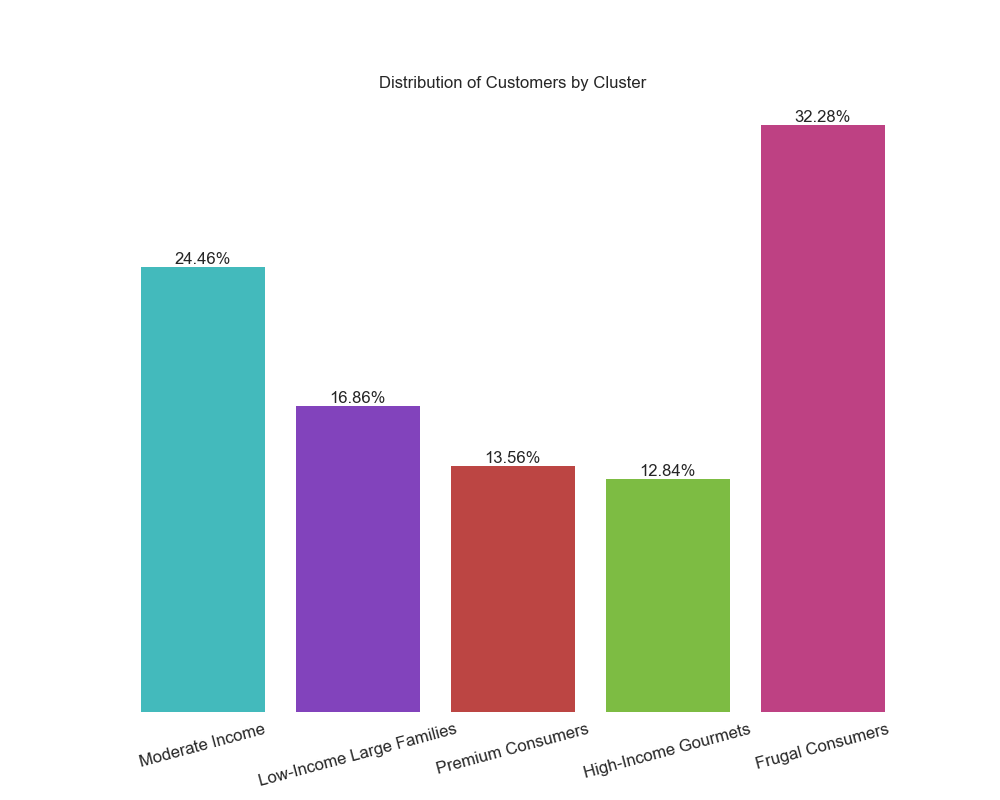

# Customer Segmentation and Marketing Campaign Response

## Project Overview

This project aims to enhance the understanding of customer segments and predict their responses to marketing campaigns. By clustering customers based on their purchasing behaviors and demographics, and by predicting their responses to promotional offers, companies can tailor marketing strategies to different customer groups, thereby increasing engagement and reducing costs.

## Dataset

### Context

A response model can significantly boost the efficiency of marketing campaigns and overall customer management. The objective is to predict who will respond to an offer for a product or service and to segment customers based on their purchasing behavior and characteristics.

### Content

The dataset includes the following features:

- **AcceptedCmp1**: 1 if the customer accepted the offer in the 1st campaign, 0 otherwise
- **AcceptedCmp2**: 1 if the customer accepted the offer in the 2nd campaign, 0 otherwise
- **AcceptedCmp3**: 1 if the customer accepted the offer in the 3rd campaign, 0 otherwise
- **AcceptedCmp4**: 1 if the customer accepted the offer in the 4th campaign, 0 otherwise
- **AcceptedCmp5**: 1 if the customer accepted the offer in the 5th campaign, 0 otherwise
- **Response (target)**: 1 if the customer accepted the offer in the last campaign, 0 otherwise
- **Complain**: 1 if the customer complained in the last 2 years
- **DtCustomer**: Date of customer’s enrolment with the company
- **Education**: Customer’s level of education
- **Marital**: Customer’s marital status
- **Kidhome**: Number of small children in the customer’s household
- **Teenhome**: Number of teenagers in the customer’s household
- **Income**: Customer’s yearly household income
- **MntFishProducts**: Amount spent on fish products in the last 2 years
- **MntMeatProducts**: Amount spent on meat products in the last 2 years
- **MntFruits**: Amount spent on fruits products in the last 2 years
- **MntSweetProducts**: Amount spent on sweet products in the last 2 years
- **MntWines**: Amount spent on wine products in the last 2 years
- **MntGoldProds**: Amount spent on gold products in the last 2 years
- **NumDealsPurchases**: Number of purchases made with a discount
- **NumCatalogPurchases**: Number of purchases made using catalogues
- **NumStorePurchases**: Number of purchases made directly in stores
- **NumWebPurchases**: Number of purchases made through the company’s website
- **NumWebVisitsMonth**: Number of visits to the company’s website in the last month
- **Recency**: Number of days since the last purchase

### Acknowledgements

The dataset is based on the work by O. Parr-Rud, described in *Business Analytics Using SAS Enterprise Guide and SAS Enterprise Miner*, SAS Institute, 2014.

### Inspiration

The main objective is to train a predictive model which allows the company to maximize the profit of the next marketing campaign and better understand customer segments.

## Project Description

### Customer Segmentation Analysis

To better understand the customer base, we performed clustering using the KMeans algorithm. Customers were grouped into 5 distinct clusters based on their purchasing behaviors, demographics, and response patterns to marketing campaigns.

Let's start with the name and short description of each cluster, as well as the overall percentage distribution of the clusters.

#### Moderate Income

Moderate income, average number of children, high spending on wine, moderate spending on other products, frequent online and in-store purchases, often make web purchases and have highest membership.

#### Low-Income Large Families

Low income, highest number of children, low spending on all product categories, infrequent purchases.

#### Premium Consumers

High income, few children, high spending on all product categories, frequent purchases.

#### High-Income Gourmets

Very high income, almost no children, very high spending on wine and meat, moderate spending on other products, frequent purchases.

#### Frugal Consumers

Low income, average number of children, low spending on all product categories, infrequent purchases.

Below, you will find the characteristics of each cluster represented in bar plots.

#### Moderate Income

People in this cluster make the most online purchases compared to others.

#### Low-Income Large Families

#### Cluster 3

#### Cluster 4

#### Cluster 5

## Conclusion

The customer segmentation analysis provides valuable insights into different customer groups, helping to tailor marketing strategies more effectively. The predictive model further optimizes marketing efforts by identifying likely responders, maximizing campaign profitability.
